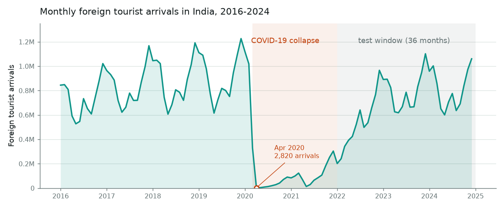
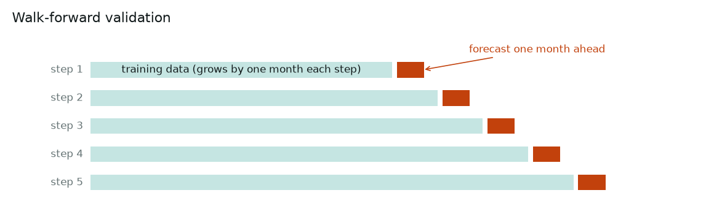
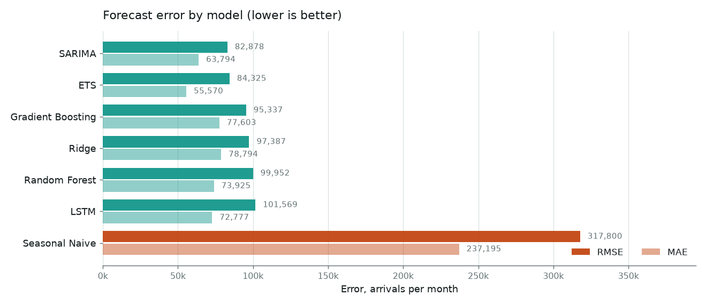
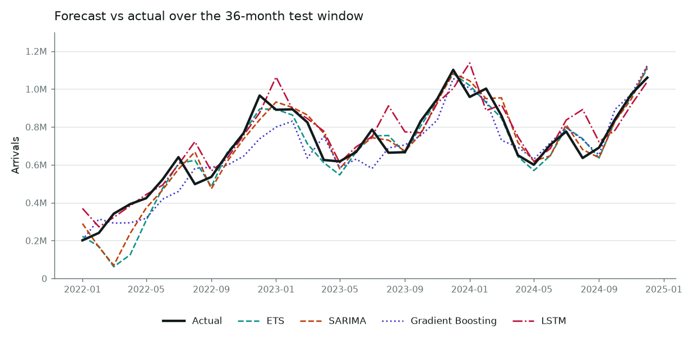
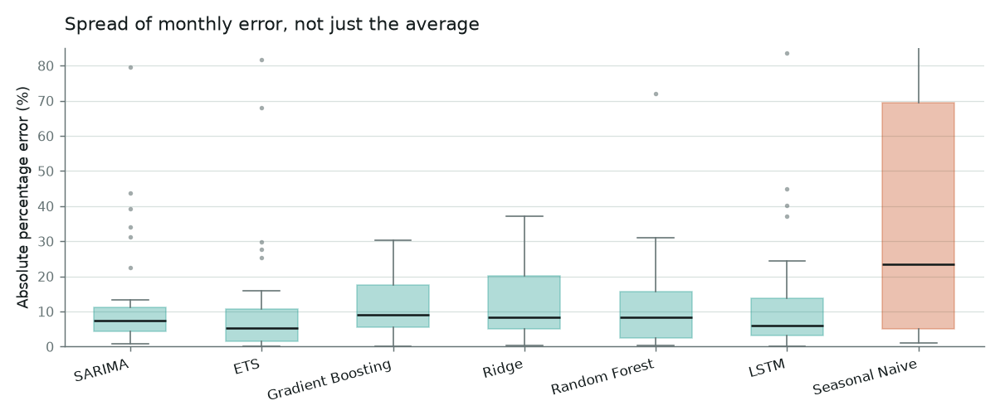

# Forecasting Monthly Foreign Tourist Arrivals in India

Predicting how many foreign tourists arrive in India each month, using past
arrivals and Google search interest in Indian travel.

## The problem

India's official tourist arrival figures are published about three weeks after
the month ends. Hotels, airlines and tourism boards would like the number
sooner. This project forecasts the current month's arrivals from what is
already known: past arrival figures, and real-time Google search interest in
terms like "flights to india" and "goa".

## The series



Nine years of monthly arrivals, 108 observations in total. Two things stand
out. The first is a steady annual cycle, with arrivals peaking in December and
January and falling to their lowest during the summer monsoon. The second is
the pandemic: arrivals fell from 1,226,398 in December 2019 to 2,820 in April
2020, a drop of 99.8%. Recovery over 2022 to 2024 brought the annual total back
to 9.76 million, still short of the 10.93 million recorded in 2019.

The test window sits after the collapse, so percentage errors are measured
against normal-sized arrival counts.

## Data

| | |
| --- | --- |
| Target | Monthly Foreign Tourist Arrivals, all-India, Jan 2016 – Dec 2024 (108 months) |
| Source | Ministry of Tourism, via the data.gov.in open-data API |
| Predictors | Google Trends weekly search interest, 7 travel terms, averaged to monthly |
| Combined | `data/tourism_monthly.csv` — 108 rows, 8 columns, no missing values |

The seven search terms were chosen for face validity before any modelling —
`flights to india`, `india visa`, `hotels in india`, `taj mahal`, `goa`,
`kerala tourism`, `india tourism` — and never changed afterwards.

## Features

25 features, all computable at the end of the month being forecast:

- **Arrival lags** — 1, 2, 3 and 12 months back
- **Rolling means** — 3-month and 12-month, shifted so they never include the current month
- **Search interest** — current month and previous month, for each of the 7 terms
- **Seasonality** — `sin`/`cos` of the month number, plus month index and a linear time trend

## Models

| Model | Type |
| --- | --- |
| Seasonal Naive | benchmark — repeat the same month last year |
| SARIMA(1,1,1)(0,1,1,12) | classical time series |
| ETS (Holt-Winters) | exponential smoothing, additive trend and seasonality |
| Ridge | linear, L2 regularised |
| Random Forest | tree ensemble |
| Gradient Boosting | tree ensemble |
| LSTM | 1 layer, 16 hidden units |

## Validation



**Walk-forward validation over the last 36 months (2022–2024).** The model is
retrained from scratch at every step and forecasts one month ahead, so a
forecast for a given month never sees that month or anything after it. This is
the right approach for time series: a random train/test split would train on
months that come *after* the one being predicted, letting the model learn from
the future.

## Results

One month ahead, 36 test months:

| Model | MAE | RMSE | MAPE | Accuracy |
| --- | --- | --- | --- | --- |
| **SARIMA** | 63,794 | **82,879** | 12.2% | 87.8% |
| **ETS** | **55,570** | 84,326 | **11.0%** | **89.0%** |
| Gradient Boosting | 77,603 | 95,338 | 11.8% | 88.2% |
| Ridge | 78,794 | 97,388 | 12.7% | 87.3% |
| Random Forest | 73,926 | 99,952 | 11.9% | 88.1% |
| LSTM | 72,778 | 101,570 | 12.2% | 87.8% |
| Seasonal Naive | 237,196 | 317,800 | 38.4% | 61.6% |



Every model beats the seasonal naive benchmark by a factor of three or more.
Paired *t*-tests on the 36 monthly absolute errors confirm the margin at
*p* < 0.001 for all six, cutting mean absolute error by between 158,000 and
182,000 arrivals a month. Differences among the six are small against the
variability of a 36-month sample, so they are best read as a group of
comparable performers: any of them is a sound choice for this task.

LSTM mean validation loss: **0.0059** (MSE on min-max scaled data).

### Forecast vs actual



All the models follow the seasonal shape closely. Most of the disagreement
appears at turning points, especially the December peaks, where the tree-based
models fall short of the seasonal high. The LSTM lags slightly, as one would
expect from a one-step model that feeds its own predictions back in.

### Error spread



The six models are also steadier than the benchmark, not just better on
average. Their interquartile ranges are comparable and narrow, while the
benchmark combines a higher median with a far wider spread.


## Running it

```bash
pip install -r requirements.txt
python forecast.py      # trains all models, writes results.csv and predictions.csv
python make_plots.py    # regenerates every figure above
```

`forecast.py` also writes `forecast_plot.png`. An interactive version of the
results is in `dashboard.html`.
